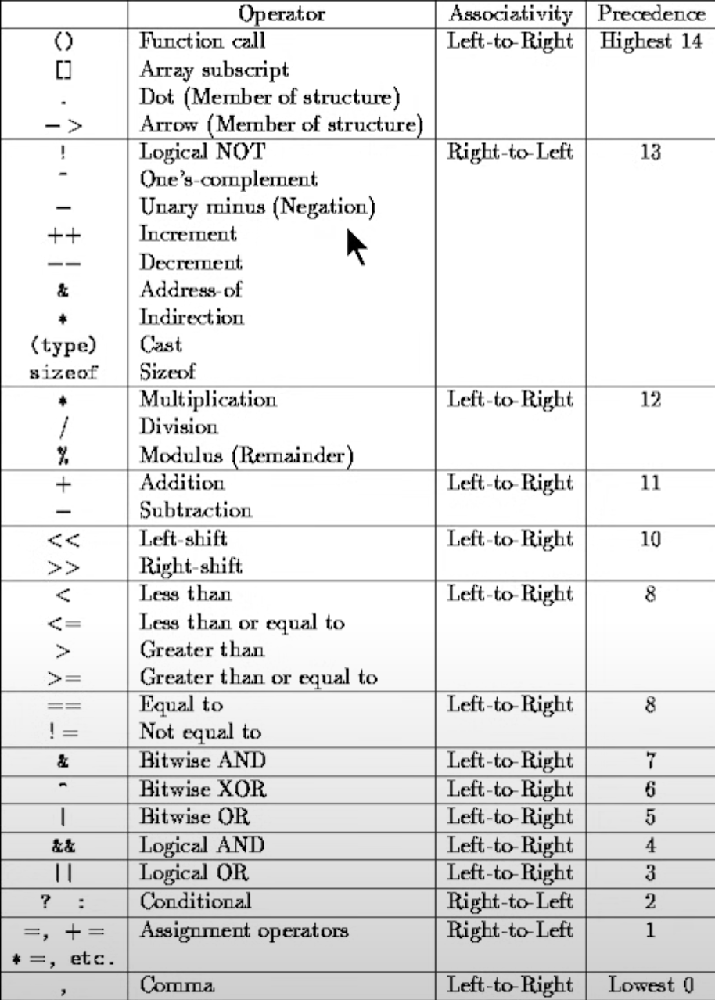

# Operators in Java

- Arithmetic 
    - Cannot work with booleans
    - Modulo Operator ( % ) works on floats and doubles ( Can give decimal remainder )
- Assignment 
- Comparision
- Logical
    - Logical AND ( && )
    - Logical OR ( || )
- Bitwise
    - Bitwise AND ( & )
    - Bitwise OR ( | )
  
## Precedence and Associativity
