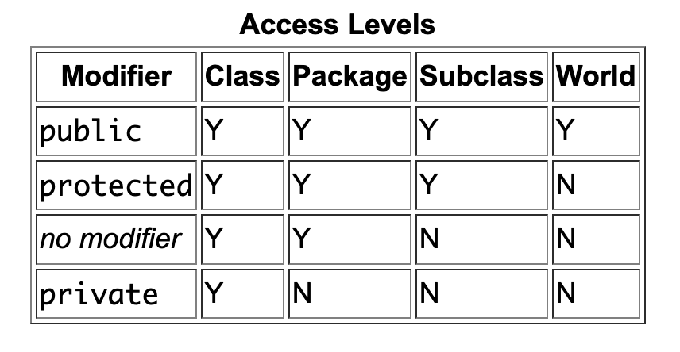

# Access Specifiers in Java

1. private
2. public
3. protected
4. default
---
1. **private**

Cannot be Accessed (Viewed/Modified) outside the class (not even by its own Object). Hence they can only be accessed from the Methods in their Class

>[!IMPORTANT]
Getters and Setters are used to View/Modify the attributes, so that any functions can be carried out while getting/setting an attribute or performing any checks.

```java
public class Employee {
    private int id;
    String name;

    public int getId() {
        return id;
    }

    public int setId(int id) {
        this.id = id;
    }
}
```

2. **public** - visible to all classes everywhere
3. **protected** - can only be accessed within its own package and, in addition, by a subclass of its class in another package.
4. **default** ( also known as **package-private**) - visible only within its own package

## Non-Access Modifiers

1. **static**  
Static keyword is used to associate a Method/variable of a given Class with the Class rather than the Object.  
Static method/variable in a Class is shared by all the Objects.  
Hence the method can be called directly without creating an Object.  
A static variable means that the variable exists once and isn't bound to an instance of a class.

2. **final**  
The final keyword is used to indicate that a variable, method, or class cannot be modified or extended.  
Declaring a variable as final prevents its value from being changed after initialization, useful for constants.  
Final variables must be initialized either at the time of declaration or in the constructor of the class. This ensures that the value of the variable is set and cannot be changed.




## References 
[Oracle Docs Access Specifiers](https://docs.oracle.com/javase/tutorial/java/javaOO/accesscontrol.html)

[GeeksforGeeks final Keyword](https://www.geeksforgeeks.org/final-keyword-in-java/)

[StackOverflow final and static Access Modifiers](https://stackoverflow.com/a/15656208)